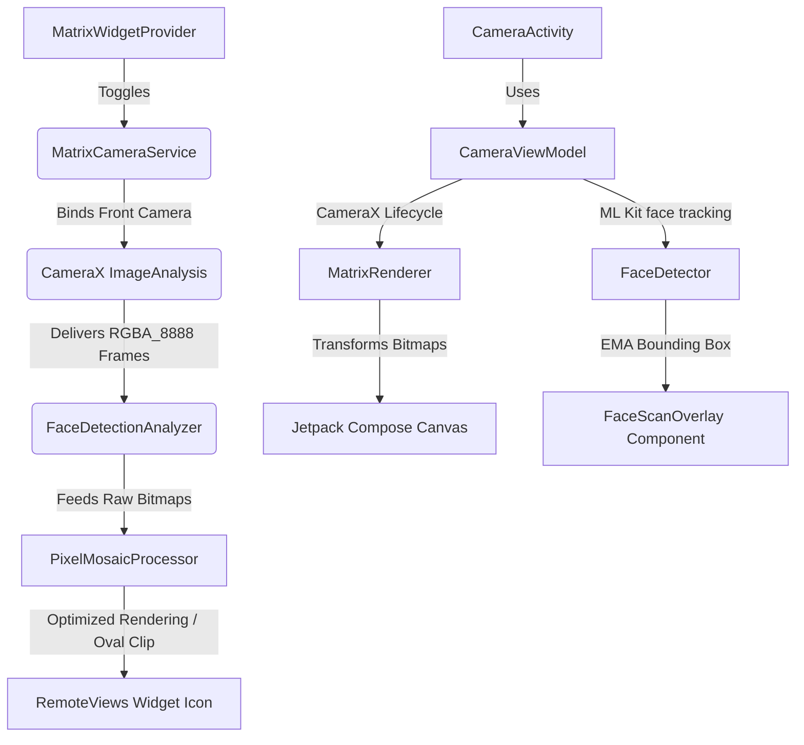

# Matrix Camera 🕶️

> **Live Nothing-inspired Matrix Camera experience for Nothing Phone and CMF devices.**
>
> A premium, minimalist Android application that transforms your live front camera feed into high-fidelity real-time matrix and pixel art configurations. Modeled as an experimental utility from **Nothing Labs**, it delivers zero-latency visuals and a native homescreen widget integration.

---

## 📖 Table of Contents
1. [Core Objectives & Concept](#-core-objectives--concept)
2. [Project Architecture](#%EF%B8%8F-project-architecture)
3. [Visual Styles Engine](#%EF%B8%8F-visual-styles-engine)
4. [Performance & Engineering Optimizations](#-performance--engineering-optimizations)
5. [Getting Started & Installation](#-getting-started--installation)
6. [Permissions & Privacy](#-permissions--privacy)
7. [Future Enhancements](#-future-enhancements)

---

## 🎯 Core Objectives & Concept
Matrix Camera is designed to behave like a native Nothing OS experimental system app rather than a typical camera utility:
* **Minimalist UI/UX:** Adheres strictly to Nothing OS aesthetics—pure black (`#000000`) backgrounds, white matrix dots, mono fonts, and clean widgets.
* **Instant Start:** Launches in under a second directly from a homescreen widget.
* **Pixel Privacy:** Entirely local processing with no network access, background tracking, or unnecessary foreground services.

---

## 🛠️ Project Architecture



### Module Overview:
* **`com.nthg.matrixcamera.matrix`**
  * [`MatrixStyle.kt`](file:///home/cyberwhiz/Projects/nthg-mtrx-wdgt/app/src/main/java/com/nthg/matrixcamera/matrix/MatrixStyle.kt): Defines the enum styles (`NOTHING_MATRIX`, `LED_MATRIX`, `ASCII_TERMINAL`, `DOT_GLYPH`, `RETRO_LCD`, `PIXEL_GAMEBOY`).
  * [`MatrixRenderer.kt`](file:///home/cyberwhiz/Projects/nthg-mtrx-wdgt/app/src/main/java/com/nthg/matrixcamera/matrix/MatrixRenderer.kt): Houses the active canvas-based pixel conversion rendering engine used in-app.
* **`com.nthg.matrixcamera.processor`**
  * [`PixelMosaicProcessor.kt`](file:///home/cyberwhiz/Projects/nthg-mtrx-wdgt/app/src/main/java/com/nthg/matrixcamera/processor/PixelMosaicProcessor.kt): An ultra-optimized mosaic processor featuring custom JNI batch writing (`setPixels`) and temporal blending. Used primarily for widget rendering.
* **`com.nthg.matrixcamera.face`**
  * [`FaceDetector.kt`](file:///home/cyberwhiz/Projects/nthg-mtrx-wdgt/app/src/main/java/com/nthg/matrixcamera/face/FaceDetector.kt): Coordinates the ML Kit client in a coroutine-friendly suspend wrapper to identify center, bounds, smiling probability, and eye positions.
* **`com.nthg.matrixcamera.widget`**
  * [`MatrixWidgetProvider.kt`](file:///home/cyberwhiz/Projects/nthg-mtrx-wdgt/app/src/main/java/com/nthg/matrixcamera/widget/MatrixWidgetProvider.kt): Handles the 2x2 homescreen widget lifecycle.
  * [`MatrixCameraService.kt`](file:///home/cyberwhiz/Projects/nthg-mtrx-wdgt/app/src/main/java/com/nthg/matrixcamera/widget/MatrixCameraService.kt): A foreground service running on a dedicated thread to feed live processed camera matrices onto the homescreen widget RemoteViews.

---

## 🎨 Visual Styles Engine
The project includes **six distinct rendering styles**, accessible in real-time via the bottom controller style-switcher:

1. **Nothing Matrix (`NTHG`):** The signature aesthetic. Converts camera luminance into variable-radius white circles with customized dot alphas.
2. **LED Matrix (`LED`):** emulates a physical LED display. Draws circular elements overlaying soft radial glow halos.
3. **ASCII Terminal (`ASCII`):** Maps screen brightness onto monospace glyphs (` .:-=+*#%@`), generating real-time text-mode camera feeds.
4. **Dot Glyph (`GLPH`):** inspired by Nothing Phone's glyph interface layout. Converts every target cell into a micro 2x2 clustered dot configuration.
5. **Retro LCD (`LCD`):** Renders vintage segmented rectangular LCD pixel chunks using 4 levels of grayscale.
6. **Pixel Game Boy (`GBY`):** Downscales images into classic 8-bit retro gaming visuals utilizing a custom 4-shade green sub-palette.

---

## ⚡ Performance & Engineering Optimizations
To maintain a stable **30 FPS** and prevent thermal throttling on mid-range devices like the Nothing Phone (2a) and CMF Phone 1, the codebase implements several optimization rules:

* **Direct RGBA_8888 Capture:** CameraX image analysis is configured to output `RGBA_8888` formats directly, avoiding the CPU-heavy JPEG compression trip.
* **Pre-allocated Buffers:** `PixelMosaicProcessor` pre-allocates primary buffers (`rawLuminances`, `smoothedLuminances`, `pixelsBuffer`, `sourcePixels`). This maintains a zero-allocation hot path and prevents GC pressure hiccups.
* **JNI Pixel Batching:** Replaces expensive repeated canvas drawing loops (over 2,000+ separate JNI calls) with a single `Bitmap.setPixels()` call directly writing an entire frame's integer array buffer.
* **Exponential Moving Average (EMA) Tracking:** Smooths out Face ML Kit bounding box coordinates across frames to remove jitter and create a fluid face scanning overlay.
* **Elevated Priority Background Threads:** Background image collection runs on a dedicated `HandlerThread` scheduled with `Process.THREAD_PRIORITY_VIDEO` to keep UI threads entirely free.

---

## 🚀 Getting Started & Installation

### Prerequisites
* Android Studio Ladybug (or newer)
* Android SDK 35 (compileSdk/targetSdk)
* Android 14+ Device (minSdk 26 supported)

### Gradle Integration
Add the core dependencies in your app's `build.gradle.kts`:
```kotlin
dependencies {
    // CameraX
    implementation("androidx.camera:camera-core:1.4.0")
    implementation("androidx.camera:camera-camera2:1.4.0")
    implementation("androidx.camera:camera-lifecycle:1.4.0")
    implementation("androidx.camera:camera-view:1.4.0")
    
    // ML Kit Face Detection
    implementation("com.google.mlkit:face-detection:16.1.7")
}
```

### Build Commands
Compile and deploy the debug package directly onto a connected device:
```bash
# Clean and assemble the debug build
./gradlew assembleDebug

# Install and run
./gradlew installDebug
```

---

## 🔒 Permissions & Privacy
The app follows modern Android security guidelines:
1. `android.permission.CAMERA`: Used exclusively to render the active Matrix camera view.
2. `android.permission.FOREGROUND_SERVICE` & `FOREGROUND_SERVICE_CAMERA`: Allows the homescreen widget to process frames in the background when active.
3. **No Network Permissions:** Guaranteed offline execution. Zero data telemetry is sent from the device.

---

## 🔮 Future Enhancements
* **Gesture-triggered Capture:** Smile-detection and blink-to-capture algorithms mapped via ML Kit classification probability.
* **Lock Screen Shortcut:** Direct camera lock screen slot for custom launcher support.
* **Wear OS Companion:** Synchronous camera feed displaying real-time Matrix outputs on wearable devices.
